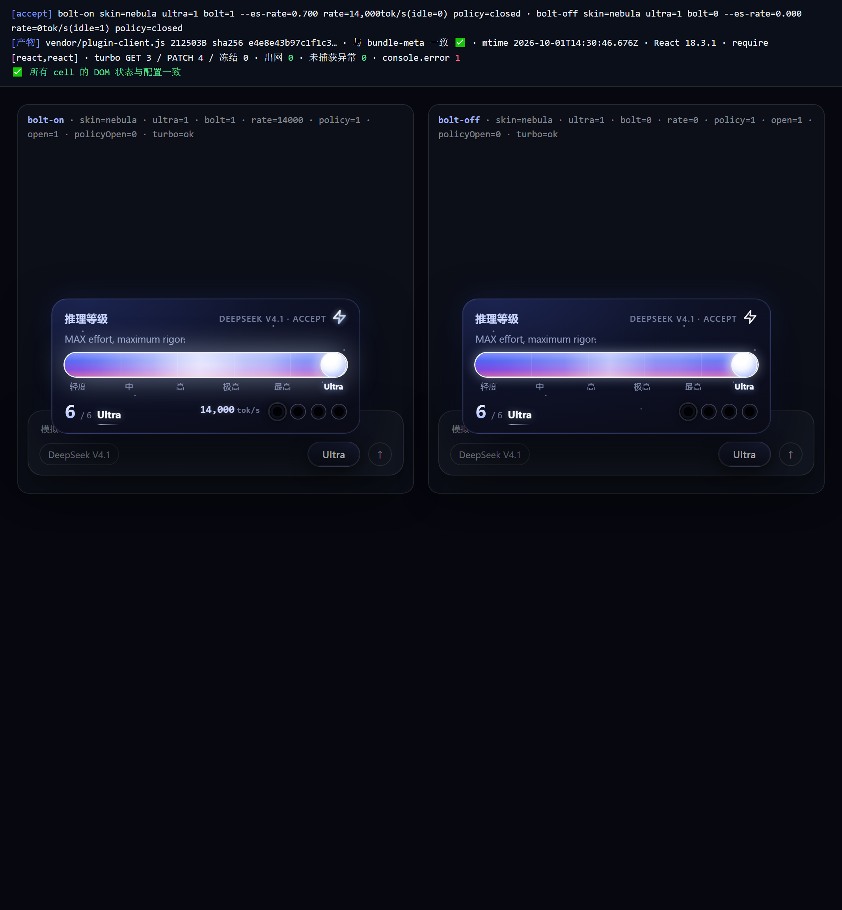
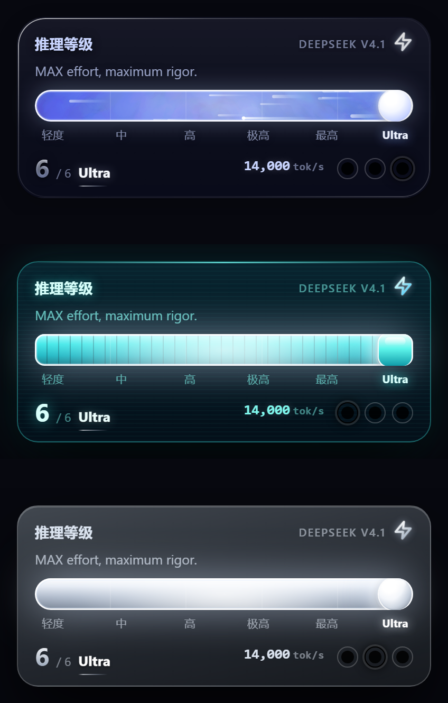

# dsh-effort-slider

[简体中文](README.md) | **English**

> A **sci-fi reasoning-effort slider** for [DeepSeek Harness](https://github.com/deepseek-ai/deepseek-harness) (DSH): a glowing core sits in the composer, and clicking it opens a floating energy bar you can point, drag or arrow-key through the model's reasoning levels.

<p align="center"></p>

---

## What it is

DSH ships a plain dropdown for reasoning effort. This plugin replaces it with an **energy slider**: levels are marked by ticks and can be clicked, dragged, or stepped with the arrow keys, each with its own visual feedback (glow, star trails, incandescent core). The level names and count follow the current model's real reasoning levels; when a model has none, the whole control hides itself.

It does **one thing**: switch the reasoning effort (writing the real `reasoningEffort` back into the model directory). Above the highest level there is one more stop — **Ultra** — which pins the reasoning effort to that model's highest real level (MAX).

> ⚠️ Earlier versions also shipped "Ultra / Lightning policy injection" and a "subagent tok/s readout" — features that injected prompt text into the session. **They have been removed entirely**: the plugin no longer injects anything, registers no host routes, and reads no session history. It is now a pure-UI level slider.

## Screenshots

| | |
| --- | --- |
|  |  |
| Expanded panel: rail + ticks + readout | Skins `holo` / `chrome` / `fluid` (default: fluid) |

## Details

### Levels and Ultra
- Shown levels = the model's real levels **plus one appended `Ultra` stop**; selecting Ultra writes the **highest real level (MAX)** id back into the model directory — `Ultra` never appears in the model directory itself.
- Invariant: **whenever the UI rests on Ultra, the real reasoning effort is MAX** (drag release, tick click and arrow keys all go through the same write path).
- The level is spelled **`Ultra`**, not all-caps `ULTRA`.
- A failed commit reverts to the previous level and shows a hint; a commit that does not land within 10 seconds stops waiting (the host operation is *not* cancelled), and a later host success still wins because the real directory state is authoritative.

### Skins
- `holo` (hologram), `chrome` (liquid metal), `fluid` (fluid, **default**, with a particle fluid engine and a top-level star trail).
- `nebula` (interstellar) was **retired on request**: it is only commented out of the skin array, `SKIN_LABELS` and all its CSS rules remain. To restore it, put `"nebula"` back and adjust `DEFAULT_SKIN`.

## Install

Requires **DSH Desktop ≥ 2.0.9**. A prebuilt `lib/client.js` ships in the repo — install and go, **no build step needed**.

```bash
# Recommended: install straight from GitHub
dsh plugin add github:realjhen123/dsh-effort-slider
```

Manual install: copy the repo directory into `<DSH_HOME>/plugins/` (on Windows: `C:\Users\<you>\.dsh\plugins\`), then restart DSH. The bundled `cordis.patch.yml` is picked up automatically by the profile bundle mechanism.

Uninstall: delete that directory (and the entry in your profile's `dsh.profile.bundles`, if you registered one there), then restart DSH.

## How it works

Two halves.

**Client half** (`client.js` + `effort-slider.css`)
- Registers through `window.__ModuleLoader__.load({ id, factory })`; React comes from `require('react')`. It mounts into the composer tool row (`conversation.input.right`).
- Sources are not read by the host directly: `node build.mjs` inlines the CSS into `lib/client.js` and asserts the inlined CSS is byte-identical to `effort-slider.css`.
- Reading and writing levels both go through the host's real model directory store (`ctx.modelDirectories.directoryFor(sessionId)`), writing `reasoningEffort`.

**Host half** (`index.mjs`)
- `GET/POST /plugins/dsh-effort-slider/preferences`: skin preference + client heartbeat (per-phase startup reporting, used to tell whether the UI actually appeared).
- Preference lives in `<DSH_HOME>/storages/effort-slider.json`: `{ skin }`.

## Data & privacy

- Reads/writes only that one local JSON file; **makes no outbound network requests** (no telemetry, no reporting).
- Injects no prompt text and reads no session history.

## Build & test

Node ≥ 22 only (zero runtime dependencies).

```bash
node build.mjs              # inline CSS -> lib/client.js, with byte-level assertions
npm test                    # all offline suites below
node smoke-test.mjs         # client: loader shape, component render, skin/boundary regressions
node test/host.test.mjs     # host: endpoints, preference file, heartbeat, no exception escape
node test/fluid.test.mjs    # fluid engine: density/column coverage/colour semantics/top-level speedup
node test/client-lifecycle.test.mjs # client: level commits, timeout rollback, session switching
```

The skin list and default skin in the tests are read from `client.js` rather than hard-coded, so retiring a skin or changing the default keeps the tests in sync with the source.

## Layout

```
client.js            client half (UI + fluid engine + level read/write)
effort-slider.css    all styles (all four skins, including the retired nebula)
build.mjs            client.js + CSS -> lib/client.js
lib/client.js        build artifact (committed; install-ready)
index.mjs            host half (preference endpoint + heartbeat verdict, fail-open)
test/                offline test suites
skills/              bundled upstream superpowers skills (unrelated to runtime; safe to delete)
THIRD-PARTY.md       credits and licences
```

## Known limits

- Updated plugin files take effect when the host next loads the plugin; running processes keep their loaded version.
- **Package name = runtime identity**: `dsh-effort-slider` is simultaneously the npm package name, the client bundle registration id (`WebBootEntry.id`), the endpoint prefix (`/plugins/dsh-effort-slider/...`) and the `data-effort-slider` attribute. **Renaming it means syncing four places**: `package.json` `name`, the bundled `cordis.patch.yml` `name`, the profile's `dsh.profile.bundles` entry, and the junction pointing at the plugin directory under `profiles/<profile>/node_modules`. Any mismatch makes DSH throw `package identity is invalid for <name>` during profile assembly and refuse to start (a real bug this project hit).
- Skin `nebula` is retired but its code remains; `DEFAULT_SKIN` and the skin allowlists (`client.js` and `index.mjs`) must change together — a test checks this consistency.
- Screenshots in this repo come from a verification bench (real artifact + real React); grey captions outside the widget are bench annotations, not part of the plugin.

## Credits

The plugin's **code** is original. Third-party sources and licences are in [`THIRD-PARTY.md`](THIRD-PARTY.md).

Zero runtime dependencies, no network, no telemetry.
